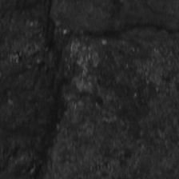

## 简介
这是我的本科毕设，
代码非常简单，只有三个文件：train, predict, model。
相信你看懂之后会对pytorch框架实现图片分类任务有初步的认识。

煤炭是经济发展建设的重要的能源，矸石是一种伴随着煤的开采而产生的一种杂质矿石，
它的存在不仅降低了煤的品位，还加重了煤燃烧时的污染，
因此煤与矸石的分选具有重要意义。

## 图片来源
样本来自山西的一个矿场，相机为海康威视的 MVL-MFO828M-8MP工业相机，采取四周打光，在0.4m/s的传送带上运行拍摄。
本项目采集的煤84张，矸石91张，原图大小为2448×2048，经过图像算法处理后，裁取得到224×224的图像，样本示例如图：
左为煤，右为矸石。

 

## 使用
请先解压样本（0是矸石，1是煤），运行train得到权重文件CNN.py, 再运行predict进行预测。

## 训练过程

